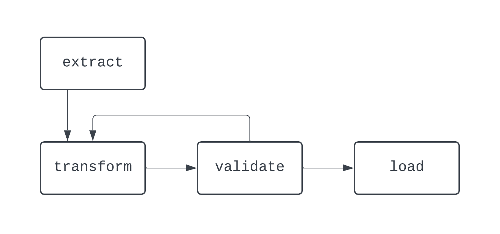

- Apache Airflow is an open-source tool and framework for running our data pipelines in production
- Airflow leverages Python to allow data practitioners to define their data pipelines as code
- Airflow adds the ability to schedule pipeline execution and observe performance,

### Features of Apache Airflow
- Simples unit: task or operations in data pipeline
- ETL(extrat, transform, load):Dependencies define the relationships between task, in ETL the “load” task depends on the “transform” task, which, in turn, depends on the “extract” task
  
    ```
    ### DAGs
    The combination of tasks and dependencies create DAGs, or directed-acyclic graphs.

    ```


- The DAG above has three tasks, with two dependencies(basically 2 arrows). It’s considered a DAG because there are no loops (or cycles) between tasks.
- the arrow shows directed nature of the process and it is a DAG bcz there are no loops or cycles
- 



    
    this is a process which is not a DAG

    In this diagram, there is a distinct loop between the transform and validate tasks. In some cases, this DAG may run forever, if there is no way to break out of this loop


 ```
    When building data pipelines, even outside of Airflow, it’s best practice to stay away from creating workflows that can’t be represented as DAGs

```


## Features of Airflow Architecture:
To schedule DAGs, execute tasks, and provide visibility into data pipeline execution details, Airflow leverages a Python-based architecture made up of the components below:

- Scheduler, Executor, Metadata database, Webserver (UI)

Whether running Airflow locally or in a production environment, each of these components must be up and running for Airflow to function properly


- Scheduler: To schedule a DAG, a start date and schedule interval for the DAG must be provided when the DAG is written as Python code
- Executor: The executor does not run the logic within each task; it just allocates the task to be run by whatever resources are configured to do so
- Metadata DB: It basically stores logs of Dag operations; The metadata database stores information about DAG runs, such as whether or not the DAG and its associated tasks ran successfully
 ***The metadata database also stores information such as user-defined variables and connections, which help when building production-grade data pipelines***

 - The Airflow UI provides central visibility into data ingestion and delivery processes, helping to keep data teams informed and aware of their data pipeline performance.


 ## Working with Airflow:
 - Once the package completes installing, you’ll need to create all the components of an Airflow project, such as setting your Airflow home directory, creating an airflow.cfg file, spinning up the metadata database etc.


## Airflow Best-Practices
- Modularity: Don’t try to do too much in a single task. While an entire ETL pipeline can be built in a single task, this would make troubleshooting difficult. It would also make visualizing the performance of a DAG difficult. When creating a task, it’s important to make sure the task will only do one thing, much like functions in Python.

- Determinism: A deterministic process is one that produces the same result, given the same input. When a DAG runs for a specific interval, it should generate the same results every time

- Idempotency:  Idempotency ensures that even if a data pipeline is executed multiple times, it was as if the pipeline was only executed once.
    To make data pipelines deterministic, think about incorporating the following logic into your DAGs:

        - Overwrite files when DAGs are re-run, rather than creating a new file with a different name when run for the same interval

        - Use a delete-write pattern to push data into databases and  data warehouses rather than INSERTing, which may cause duplicates.
- Focus on using Airflow for very light data transformation and as an orchestration(carefully organizing things of a complex workflow) tool when wrangling larger data.